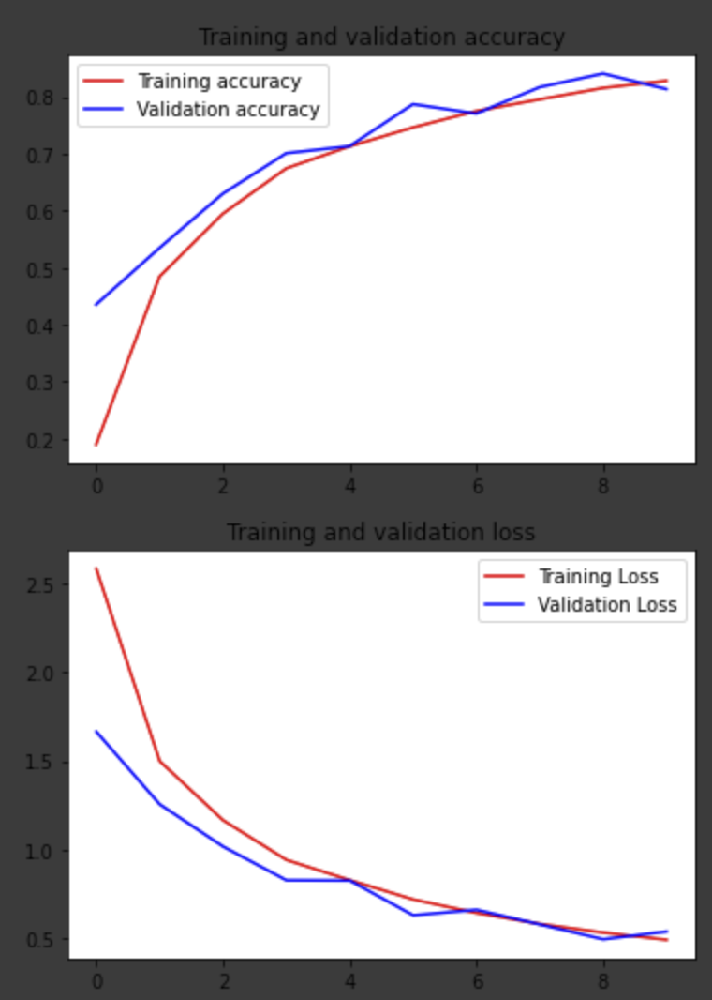

# Assignment #05-W05-First Machine Learning Project - MLCC Project
## Topic
[Sign language digit dataset](https://www.kaggle.com/ardamavi/sign-language-digits-dataset)

## Problem Framing
I want to know the meaning of american sign language letter based on hand gestures. I want to know the difference between 26 gesture. Ideal outcome I can classify hand gesture based on images. Based on that, our success metrics is the number of american sign language letter that properly classified by our model. For success metrics to get accuracy of classification 80%. Our model is failure if our model generate more than 20% false positive or false negative of sign language classification.

So, output from model will be label of alphabet of sign language from (0-25). The output from our model will be used to recognize alphabet from the hand gesture. By doing this I can caught the meaning of american sign language from the hand gesture

## Approach
The approach I use is using CNN to recognize the image
CONV2D->maxpool->CONV2d->maxpool->CONV2d->maxpool->Dense(512)->Dense(26)
## Results

## Conclusion
For Sign language dataset the model perform good performance accuracy at 82.84% it's more than hipotesis needed

## Citation
- Laurence Moroney Courses TensorFlow in Practice Specialization
- [Kaggle CNN using keras](https://www.kaggle.com/madz2000/cnn-using-keras-100-accuracy)
